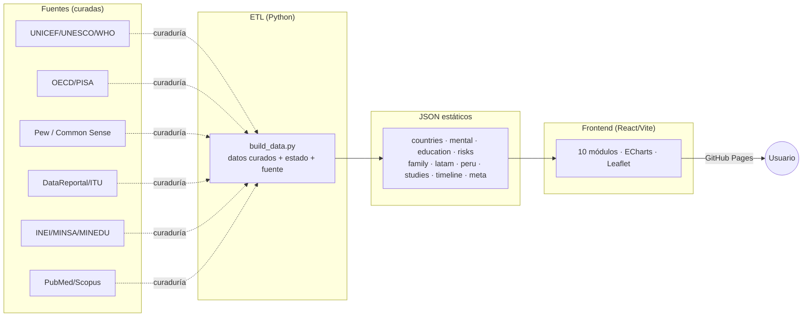
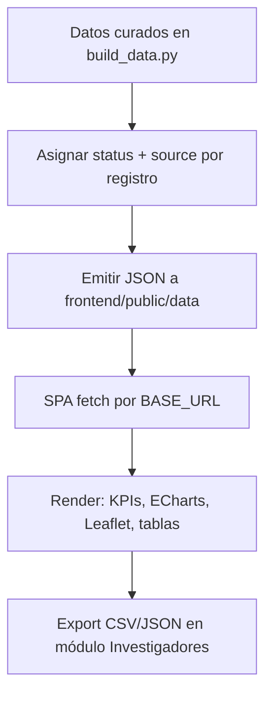
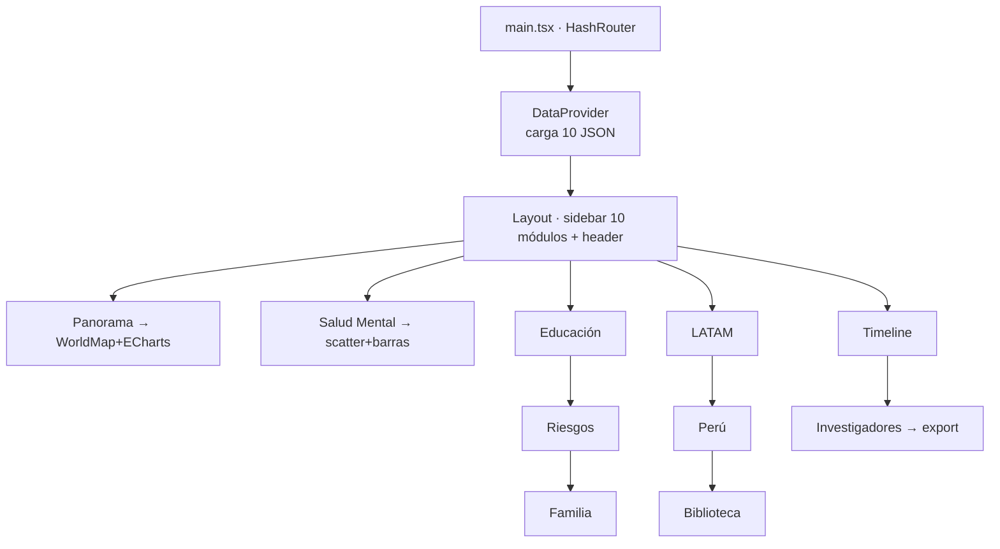

# Arquitectura — Observatorio Adolescentes & Pantallas

Plataforma **100% estática** (sin backend): el ETL en Python genera JSON; un SPA React/Vite los consume y se sirve por GitHub Pages. Gratuita, reproducible y auditable.

## Vista de alto nivel



## Flujo de datos



## Estructura de carpetas

```
observatorio-smartphones-adolescentes/
├── data/PROVENANCE.md
├── etl/build_data.py            # genera los JSON (curaduría + estado + fuente)
├── frontend/
│   ├── public/data/*.json       # salida del ETL (consumida por el SPA)
│   ├── public/favicon.svg
│   └── src/
│       ├── lib/ (data.ts, store.tsx, theme.ts, format.ts, echart-theme.ts)
│       ├── components/ (Layout, EChart, WorldMap, KpiCard, ChartCard, PageState, DataStatusBadge, ThemeToggle)
│       └── pages/ (Panorama, SaludMental, Educacion, Riesgos, Familia, Latam, Peru, Biblioteca, Timeline, Investigadores)
├── docs/ (architecture, data_model, wireframes, roadmap, seo_strategy)
└── .github/workflows/deploy.yml
```

## Componentes del frontend



## Decisiones de diseño
- **Sin backend:** alcance público y costo cero; los datos se regeneran por ETL (Action mensual), no en vivo.
- **HashRouter:** evita configurar *rewrites* en GitHub Pages.
- **Estado del dato de primera clase:** cada registro lleva `status` (`verified`/`estimate`) y `source`, visibles en la UI.
- **UI ⟂ datos:** prepara la i18n (Fase 2) sin duplicar el dataset.
- **Mapa con Leaflet + CARTO Voyager:** legible en claro y oscuro; marcadores proporcionales por indicador.
