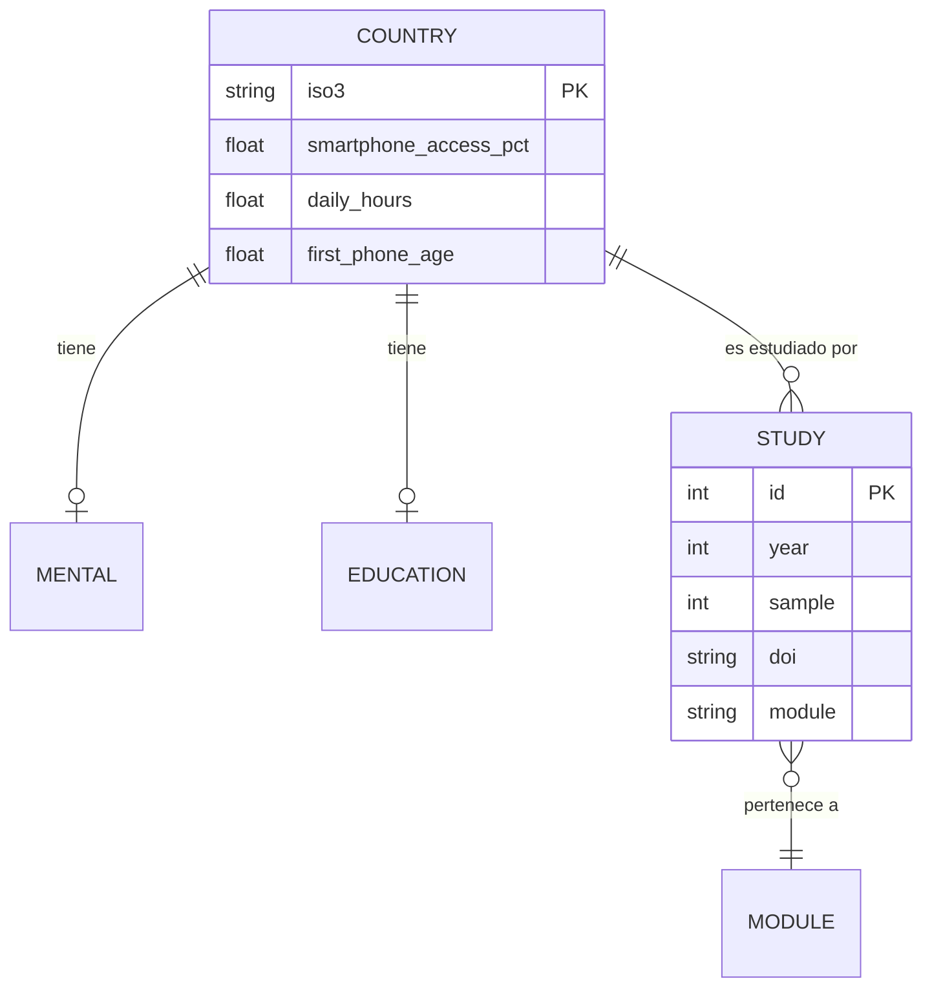

# Modelo de datos

Todos los archivos en `frontend/public/data/` los genera `etl/build_data.py`. Convención común:
cada registro de indicador lleva `status` (`verified` | `estimate`) y, cuando aplica, `source`.

## `countries.json`
```jsonc
{ "indicator_unit": "...", "rows": [
  { "country": "Perú", "iso3": "PER", "region": "LATAM", "lat": -9.2, "lng": -75.0,
    "smartphone_access_pct": 68, "first_phone_age": 11.6, "daily_hours": 6.5,
    "social_media_pct": 76, "internet_penetration_pct": 74, "status": "estimate", "source": "..." }
]}
```

## `mental_health.json`
```jsonc
{ "rows": [ { "country": "...", "anxiety_pct": 0, "depression_pct": 0, "stress_pct": 0,
    "loneliness_pct": 0, "cyberbullying_victim_pct": 0, "sleep_problems_pct": 0,
    "low_self_esteem_pct": 0, "status": "estimate" } ],
  "correlation": { "x_label": "...", "y_label": "...",
    "points": [ { "daily_hours": 1, "depression_pct": 11 } ], "note": "...", "status": "illustrative" } }
```

## `education.json`
`rows[]`: `country, academic_perception (-100..100), educational_use_pct, classroom_distraction_pct, digital_skills_pct`.

## `risks.json`
`rows[]`: `risk, prevalence_pct, source, status` · `by_age[]`: `age, problematic_use_pct`.

## `family.json`
`rows[]`: `metric, value_pct, status, source` · `first_phone_given_age[]`: `country, age`.

## `latam.json`
`rows[]`: subconjunto de países foco con indicadores de uso + bienestar.

## `peru.json`
`country, indicators[] (metric, value_pct, source, status), note, sources[] (name, url)`.

## `studies.json` (Biblioteca)
```jsonc
{ "count": 12, "rows": [
  { "id": 1, "title": "...", "authors": "...", "year": 2019, "country": "...",
    "sample": 355358, "age": "12-18", "findings": "...", "doi": "10.1038/...",
    "source": "Nature Human Behaviour", "module": "salud-mental", "status": "verified" }
]}
```
`module` ∈ {panorama, salud-mental, educacion, riesgos, latam}. `doi` puede ser `null` (sin DOI verificado).

## `timeline.json`
`rows[]`: `year, title, desc` (2005–presente).

## `meta.json`
`title, n_countries, n_studies, disclaimer, sources[]`.

## Esquema de "estado del dato"
| status | significado |
|---|---|
| `verified` | cifra citable tomada de un reporte/estudio concreto |
| `estimate` | síntesis plausible de varias fuentes; orden de magnitud |
| `illustrative` | demostrativo del método (p.ej. nube de correlación) |

## Modelo ER (conceptual)


